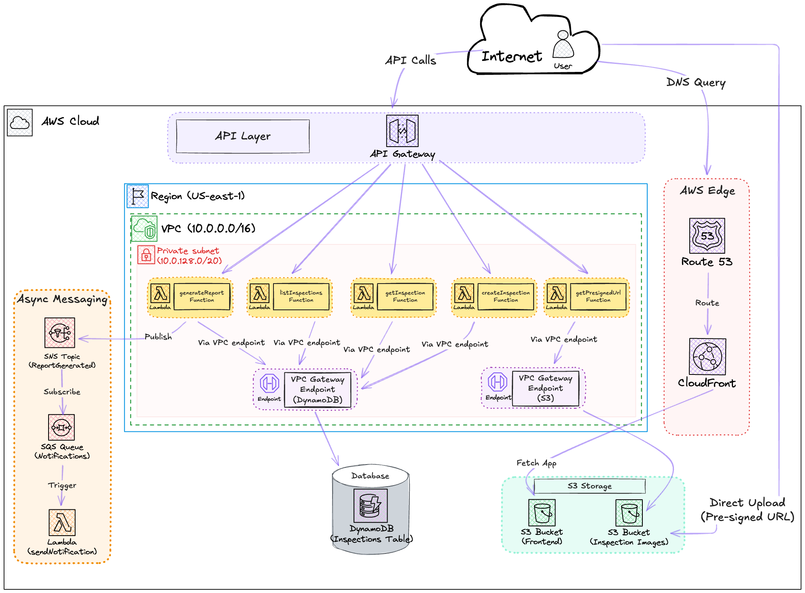

# 🏠 Serverless Building Inspection Platform

A fully serverless, event-driven building inspection application built on AWS. Inspectors can create inspections, complete checklists, upload property images, and generate reports that are automatically shared with clients.



---

## Features

- **Inspection Management** - Create, update, and track building inspections
- **Checklist Evaluation** - Assess Roof, Foundation, Plumbing, Electrical, and HVAC conditions
- **Image Upload** - Secure image uploads to S3 via presigned URLs
- **Report Generation** - One-click report generation with automatic notifications
- **Async Processing** - Event-driven notifications using SNS/SQS
- **Private Networking** - Lambda functions secured in VPC with VPC endpoints
- **Serverless Architecture** - Zero server management, pay-per-use pricing

---

## Architecture

| Component  | Service         | Purpose                               |
| ---------- | --------------- | ------------------------------------- |
| Frontend   | S3 + CloudFront | Static website hosting with CDN       |
| API        | API Gateway     | RESTful API endpoints                 |
| Compute    | Lambda          | Serverless business logic             |
| Database   | DynamoDB        | NoSQL storage for inspection data     |
| Storage    | S3              | Property image storage                |
| Messaging  | SNS + SQS       | Async notification processing         |
| Networking | VPC + Endpoints | Private Lambda access to AWS services |
| DNS        | Route 53        | Custom domain routing                 |

---

## Tech Stack

**Frontend:**

- Vite + React
- Tailwind CSS
- Lucide Icons

**Backend:**

- Node.js 18.x (Lambda runtime)
- AWS SDK v3

**Infrastructure:**

- AWS CloudFormation
- AWS SAM (Serverless Application Model)

---

## 📋 Prerequisites

- [AWS CLI](https://aws.amazon.com/cli/) configured with appropriate credentials
- [AWS SAM CLI](https://docs.aws.amazon.com/serverless-application-model/latest/developerguide/install-sam-cli.html)
- [Node.js](https://nodejs.org/) 18.x or later
- npm or yarn

---

## Quick Start

### 1. Clone the repository

```bash
git clone https://github.com/dhruwanga19/serverless-inspection-platform-aws.git
cd serverless-inspection-platform-aws
```

### 2. Deploy Infrastructure

```bash
cd infrastructure/

aws cloudformation deploy \
  --template-file cloudformation-infrastructure.yaml \
  --stack-name inspection-platform-infra \
  --parameter-overrides Environment=prod \
  --capabilities CAPABILITY_NAMED_IAM
```

### 3. Get Infrastructure Outputs

```bash
aws cloudformation describe-stacks \
  --stack-name inspection-platform-infra \
  --query 'Stacks[0].Outputs' \
  --output table
```

Save these values for the next steps.

### 4. Configure SAM

Update `backend/samconfig.toml` with the output values from step 3.

### 5. Deploy Backend

```bash
cd backend/lambdas/
npm install

cd ..
sam build
sam deploy
```

### 6. Deploy Frontend

```bash
cd frontend/

# Set API Gateway URL from CloudFormation Output Table
echo "VITE_API_URL=https://<your-api-id>.execute-api.us-east-1.amazonaws.com/prod" > .env

npm install
npm run build

# Upload to S3 (replace with your bucket name from CloudFormation Output Table)
aws s3 sync dist/ s3://<your-frontend-bucket> --delete

# Invalidate CloudFront cache
aws cloudfront create-invalidation --distribution-id <your-dist-id> --paths "/*"
```

### 7. Access the Application

Open your CloudFront URL in a browser.

---

## Project Structure

```
inspection-platform/
├── infrastructure/
│   └── cloudformation-infrastructure.yaml
├── backend/
│   ├── template.yaml
│   ├── samconfig.toml
│   └── lambdas/
│       ├── package.json
│       ├── createInspection.js
│       ├── getInspection.js
│       ├── listInspections.js
│       ├── updateInspection.js
│       ├── getPresignedUrl.js
│       ├── generateReport.js
│       └── sendNotification.js
├── frontend/
│   ├── src/
│   │   ├── App.jsx
│   │   ├── main.jsx
│   │   └── services/
│   │       └── api.js
│   ├── package.json
│   ├── vite.config.js
│   └── tailwind.config.js
└── docs/
    ├── architecture-diagram.png
    └── PROJECT_DOCUMENTATION.md
```

---

## API Endpoints

| Method | Endpoint                   | Description           |
| ------ | -------------------------- | --------------------- |
| `POST` | `/inspections`             | Create new inspection |
| `GET`  | `/inspections`             | List all inspections  |
| `GET`  | `/inspections/{id}`        | Get inspection by ID  |
| `PUT`  | `/inspections/{id}`        | Update inspection     |
| `POST` | `/inspections/{id}/report` | Generate report       |
| `POST` | `/presigned-url`           | Get S3 presigned URL  |

---

## Configuration

### Environment Variables

**Frontend (`.env`):**

```
VITE_API_URL=https://<api-id>.execute-api.<region>.amazonaws.com/prod
```

**Backend (SAM `samconfig.toml`):**

```toml
parameter_overrides = [
    "Environment=prod",
    "VPCId=vpc-xxxxxxxxx",
    "PrivateSubnetIds=subnet-xxx,subnet-yyy",
    "SecurityGroupId=sg-xxxxxxxxx",
    "DynamoDBTableName=InspectionsTable-prod",
    "ImagesBucketName=inspection-images-xxx-prod",
    "SNSTopicArn=arn:aws:sns:region:account:topic-name"
]
```

---

## Testing

### Test API Endpoints

```bash
# Set your API URL
API_URL="https://<api-id>.execute-api.us-east-1.amazonaws.com/prod"

# Create an inspection
curl -X POST $API_URL/inspections \
  -H "Content-Type: application/json" \
  -d '{
    "propertyAddress": "123 Main St, Seattle, WA",
    "inspectorName": "John Smith",
    "inspectorEmail": "john@example.com"
  }'

# List inspections
curl $API_URL/inspections
```

### Test Notification Flow

```bash
# Check Lambda logs
aws logs tail /aws/lambda/sendNotification-prod --since 30m --follow
```

---

## Issues & Solutions

During development, several challenges were encountered and resolved:

| Issue                                       | Root Cause                                             | Solution                                        |
| ------------------------------------------- | ------------------------------------------------------ | ----------------------------------------------- |
| SAM deployment failed with empty VPC config | Lambda rejects empty SubnetIds/SecurityGroupIds arrays | Remove VpcConfig from Globals, add per-function |
| 504 Gateway Timeout                         | VPC security group missing inbound rule                | Add self-referencing inbound HTTPS rule         |
| Frontend showing mock data                  | Missing VITE\_ prefix in env variable                  | Use `VITE_API_URL` and rebuild                  |

---

## Cleanup

To delete all AWS resources:

```bash
# Delete backend stack
aws cloudformation delete-stack --stack-name inspection-platform-backend

# Empty S3 buckets
aws s3 rm s3://<frontend-bucket> --recursive
aws s3 rm s3://<images-bucket> --recursive

# Delete infrastructure stack
aws cloudformation delete-stack --stack-name inspection-platform-infra
```

---

## License

This project is licensed under the MIT License - see the [LICENSE](LICENSE) file for details.

---

## Acknowledgments

- Built with [AWS Serverless](https://aws.amazon.com/serverless/)
- Frontend powered by [Vite](https://vitejs.dev/) and [React](https://react.dev/)
- Styled with [Tailwind CSS](https://tailwindcss.com/)
